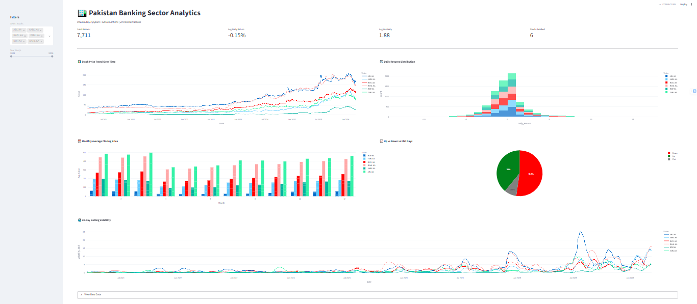
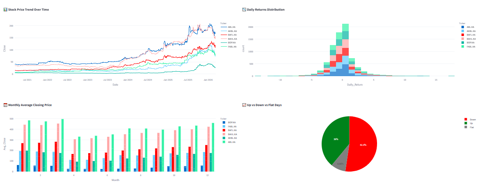
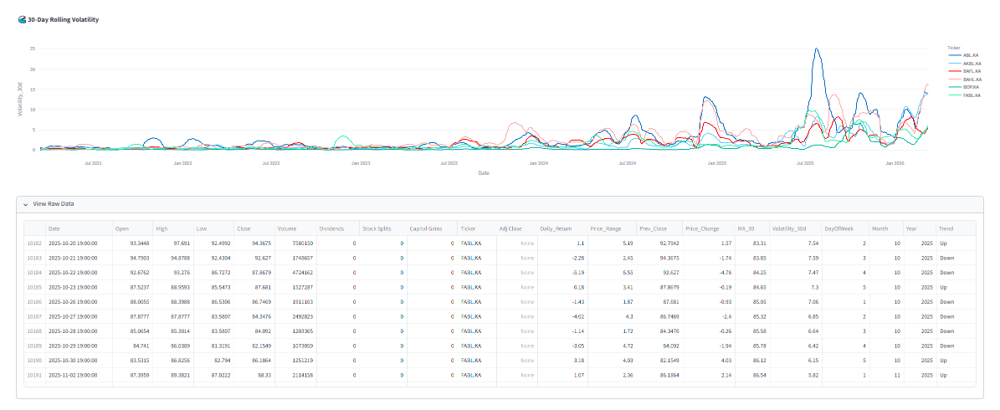
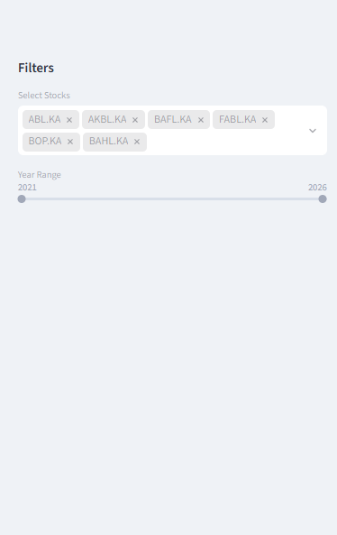
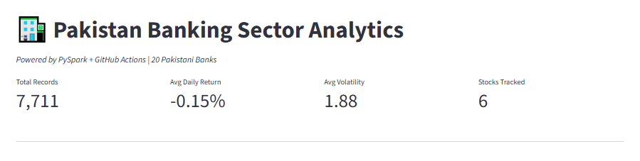

# Pakistan-Banking-Stock-Analytics

Automated end-to-end pipeline tracking 20 Pakistani banks on PSX — ingesting 5 years of stock data, transforming with **PySpark**, and visualizing insights via **Streamlit** dashboard with daily **GitHub Actions** automation."

---

## 📸 Screenshots

 
  
  
  
  


---

## 🚀 Live Demo

[View Live Dashboard](YOUR_LIVE_DASHBOARD_LINK)

---

## 🧠 Overview

Fully automated data engineering pipeline for Pakistan's banking sector analysis.  
Tracks 20 banks listed on PSX, ingests live stock data daily via **Yahoo Finance API**, processes it with **PySpark**, and visualizes insights on an interactive **Streamlit dashboard** — all triggered automatically via **GitHub Actions**.

---

## ✨ Features

- Automated daily ingestion of 20 Pakistani banks via Yahoo Finance API  
- PySpark feature engineering on 5 years of banking stock data  
- GitHub Actions CI/CD — fully automated, no manual intervention  
- Interactive dashboard with filters by stock and year range  
- 30-day rolling volatility, moving averages, trend classification  

---

## 🏗️ Architecture
```
Yahoo Finance API (20 Pakistani Banks)
        ↓
src/ingest.py           # Fetch banking stock data daily
        ↓
data/raw/               # Raw CSV storage
        ↓
src/transform.py        # PySpark feature engineering
        ↓
data/processed/         # Processed CSV storage
        ↓
app.py                  # Streamlit dashboard
        ↑
GitHub Actions          # Automates pipeline daily
```

---

## 🧰 Tech Stack

| Tool                | Purpose                         |
|--------------------|---------------------------------|
| Python + PySpark    | Data processing                 |
| Yahoo Finance API   | Real-time data ingestion        |
| GitHub Actions      | CI/CD automation                |
| Streamlit + Plotly  | Interactive dashboard           |

---

## 📊 Features Engineered

| Feature             | Description                      |
|--------------------|----------------------------------|
| Daily Return        | % change open to close           |
| MA_30               | 30-day moving average            |
| Volatility_30d      | 30-day rolling std deviation     |
| Trend               | Up / Down / Flat classification  |
| Monthly Aggregations| Avg price, volume, return        |

---

## 📁 Project Structure
```
pakistan-stock-analytics/
├── .github/
│ └── workflows/
│ └── pipeline.yml # Daily automation
├── src/
│ ├── ingest.py # Data ingestion
│ └── transform.py # PySpark transformations
├── data/
│ ├── raw/ # Raw CSVs
│ └── processed/ # Processed CSVs
├── app.py # Streamlit dashboard
└── requirements.txt
```

---

## ⚙️ Run Locally
```bash
git clone https://github.com/yourusername/pakistan-stock-analytics
cd pakistan-stock-analytics
pip install -r requirements.txt
python src/ingest.py
python src/transform.py
streamlit run app.py
```

---

## 🤖 Automation
Pipeline runs automatically every day at 11PM PKT via GitHub Actions — fetches latest banking stock data for all 20 banks, runs PySpark transformations, and commits updated CSVs to the repo.

---

## 👤 Author
Maryam Asif   
🎓 FAST NUCES   
🔗 LinkedIn | GitHub

---
